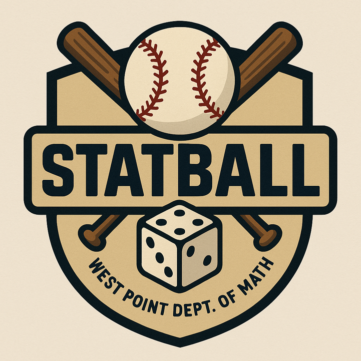
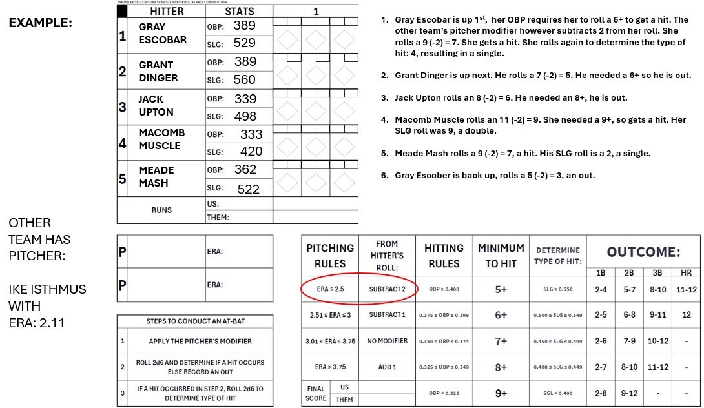
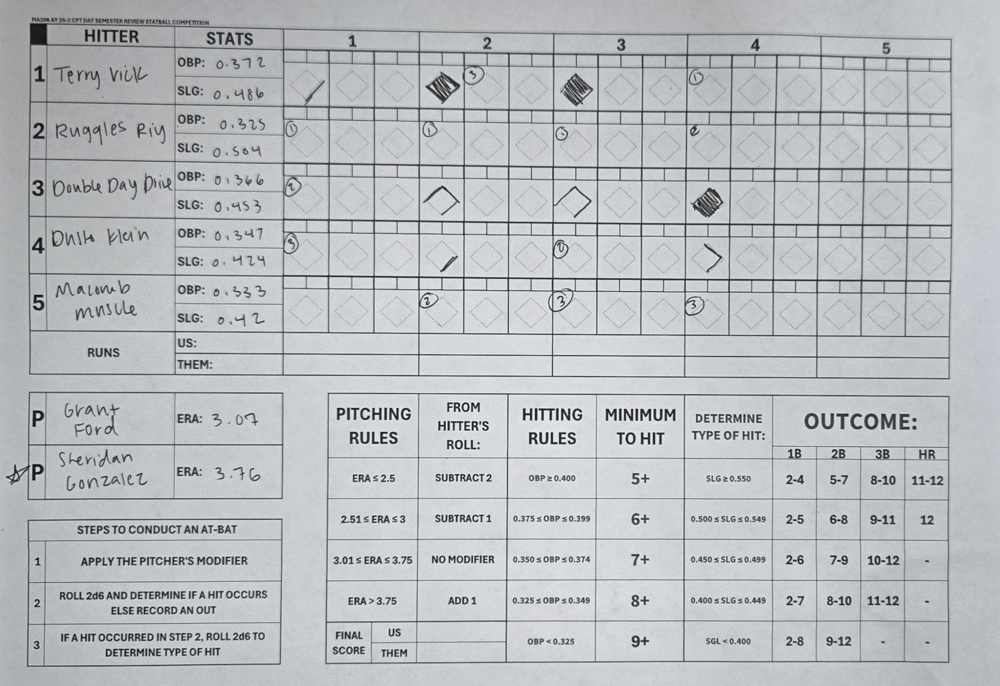

# ⚾ StatBall: A Stats-Powered Baseball Review Game

<p align="center">
  
</p>

**StatBall** is a classroom-tested dice baseball game designed to help students review probability and statistics through gameplay. By completing review questions teams earn a salary cap, draft hitters and pitchers with real statistical traits, and compete in a dice-driven baseball tournament.

https://statball.streamlit.app/

---

## 📚 Topics Covered

StatBall reinforces core intro stats concepts:

- One-proportion z-test  
- One-sample, two-sample, and paired t-tests  
- Two-proportion z-test  
- Simple and multiple linear regression  
- Probability rules (multiplication, conditional, total probability, Bayes' Rule)  
- Distributions: binomial, geometric, normal  
- Random sampling vs random assignment  

---

## 🧠 How to Play

### ⚾ 1. Quiz Phase — Earn Your Salary Cap

Students take a multiple-choice quiz (30 questions). Each correct answer earns **$1 million** in salary cap which they will use in the next phase.

> Example: 18/25 correct → $7.2M salary cap

---

### 💸 2. Draft Phase — Build Your Team

Students silently bid on:
- **5 Hitters** (each with OBP and SLG stats)
- **2 Pitchers** (with ERA stats)

Players are unique and vary in quality. OBP and SLG affect how likely a batter gets on base or hits for power. ERA modifies how effective a pitcher is defensively.

> Draft is done using silent auction: Students submit bids within their cap.

Moving forward I am going to emphasize more on scouting via an exercise in probability:

$$ 
\mathcal{E}[\text{Bases per Plate Appearance}] = P(Hit) E[ Bases | Hit ]
$$

OBP and SLG relate to the game via separate **2d6** dice rolls in tranches based on player talent. 

For instance using Grant Dinger with a 390 OBP and 560 SLG would have the following expected bases per plate appearance:

$$
\mathcal{E}[\text{Bases per Plate Appearance}] = P(6+) E[ Bases | 6+ ]
$$
$$
= \frac{26}{36} \cdot \frac{(1B(6) + 2B(15) + 3B(12) + HR(3))}{36}
$$
$$
= \frac{26}{36} \cdot \frac{(1(6) + 2(15) + 3(12) + 4(3))}{36}
$$
$$
= \frac{26}{36} \cdot 2.333 = 1.684
$$

---

### 🏆 3. Tournament Phase — Let’s Play Ball!

Teams are seeded into a **double elimination bracket**. One pitcher is selected per game. The batting team rolls 2d6 dice to simulate plate appearances, influenced by player stats.

---
## 💡Gameplay Walkthrough




## 🎲 Example Student-Completed Log Sheet




### ⚙️ Adjustments

- Better OBP → Increase Walk/Hit outcomes  
- Higher SLG → Shift Singles to Doubles/Triples  
- Lower ERA → Reduce opponent hit table  

---

## 📝 Diamond Log Rules

You’ll use a scoresheet to log results by half-inning:

- **Single** → Advance all runners 1 base  
- **Double** → Advance 2 bases  
- **Triple** → Clears the bases + batter to 3rd  
- **Home Run** → Scores all runners  
- **Walk** → Forces runners only if 1st is occupied  
- **Out** → No advancement unless it’s a fly-out sacrifice (optional rule)

Track:
- Runs by inning  
- Pitcher fatigue (optional after 3 innings pitched)  
- Offensive tallies per batter (for awards!)  

---

## 📦 Folder Structure (if using source code)

```
statball/
├── review.py          # Streamlit app walking students through Review Quiz, Player Bidding, and Explanation of Stats relating to Gameplay
├── player_stats.csv   # File holding player stats
├── requirements.txt   # Python dependecies
├── statball_log.pdf   # Game Sheets (Sorry no downloadable Dice, although https://rolladie.net/ has a great interface!
├── assets/
│   └── statball_logo.png
|   └── example_log.png
└── README.md            # This file
```

---

## 🚀 Getting Started

### 1. Clone the Repo

```bash
git clone https://github.com/your-username/statball.git
cd statball
```

### 2. Install Dependencies

```bash
pip install -r requirements.txt
```

### 3. Run the App

```bash
streamlit run app/main.py
```

---

## 👨‍🏫 Notes for Teachers

- The results of each team's quiz and player bids are recorded through Google Sheets/Drive APIs. Will need to adjust TOML file in own deployment through streamlit (or other app-hosting website to manage keys).
- Student stats review before the Term End Exam  
- Engaged, team-based learning for intro statistics  
- Adaptable to high school AP Stats or college intro courses  

---

## 🔧 Optional Modifiers

- **Pitcher fatigue rule**: ERA rises by 0.5 every inning after 3rd  
- **Slugger Bonus**: If SLG > 0.7, change one “Out” to “Double”  
- **Defensive Adjustments**: Better ERA pitcher shifts "Hit" results to "Outs"  

---

## 👥 Attribution

StatBall created by **Jonathan Day**  
Department of Mathematical Sciences  
United States Military Academy – West Point

> "There’s no crying in statistics." – Probably not Tom Hanks

---

## 📬 Contributing

Want to add new questions, player cards, or game mechanics?

- Fork the repo  
- Make your changes  
- Submit a pull request  

---

## 📝 License

MIT License. Do whatever you want, just don’t forget to swing for the fences.
